Introdução
==========

Apresentação do problema que envolve o relacionamento Many-to-Many bidirecional entre a mesma entidade.

Serão apresentadas questões problemátivas e soluções funcionais.

Nem a situação inicial e nem as soluções apresentadas tiveram métricas de testes de desempenho e recursos avaliadas, portanto o que for aqui apresentado é apenas de avaliação estrutural de código.

Mini mundo: versão 1.0
======================

Implementação disponível em [https://github.com/feluzan/many2many/releases/tag/v1.0](https://www.google.com/url?q=https://github.com/feluzan/many2many/releases/tag/v1.0&sa=D&source=editors&ust=1687279839117741&usg=AOvVaw1kT0iZkaU2xILrHBgbvw6E)

O código desenvolvido como exemplo para a situação abrange um caso de uso de uma rede social. Nessa primeira versão vamos imaginar algo com requisitos parecidos com o Instagram.

No instagram, um usuário (seguidor) pode seguir vários outros usuários (seguidos). Assim como um usuário (seguido) pode ser seguido por vários outros usuários (seguidores).

Essa situação caracteriza um relacionamento do tipo many-to-many.

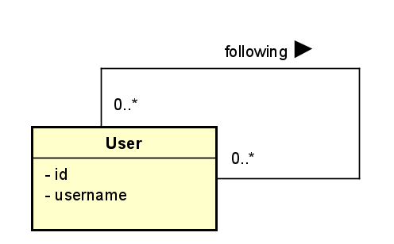

Nessa situação, ao criar dois usuários e indicar que o User1 segue o User 2, ficamos com o seguinte resultado

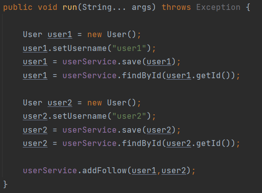

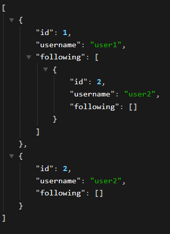

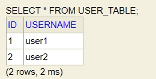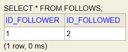

Correção de loop infinito no mapper: v1.0.1
===========================================

implementação disponível em [https://github.com/feluzan/many2many/releases/tag/v1.0.1](https://www.google.com/url?q=https://github.com/feluzan/many2many/releases/tag/v1.0.1&sa=D&source=editors&ust=1687279839119498&usg=AOvVaw1fHbZMRz57UjTQW9ng1cyZ)

A versão 1.0 já utiliza o [mapstruct](https://www.google.com/url?q=https://mapstruct.org/&sa=D&source=editors&ust=1687279839119987&usg=AOvVaw0zI2-HliH72PovqixhtNIV) para mapeamento entre model e entity. Porém, com a possibilidade de dois usuários serem seguidores mútuos um do outro, o mappeamento pode acarretar em um loop infinito, ocasionando Stackoverflow. Veja o que acontece quando adicionamos via banco de dados que os usuários user1 e user2 são seguidores mútuos:

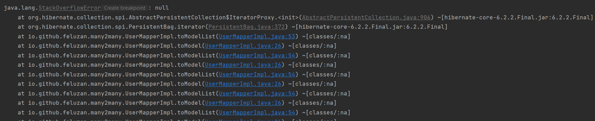

Para corrigir esse problema, faremos uma implementação para que o mapstruct não realize o mapeamento do atributo following em segundo nível.

Com essa alteração, ficamos com o seguinte estado:

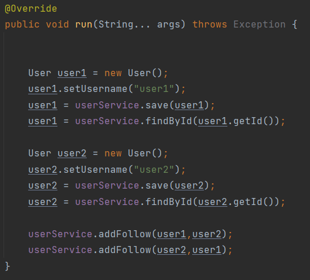

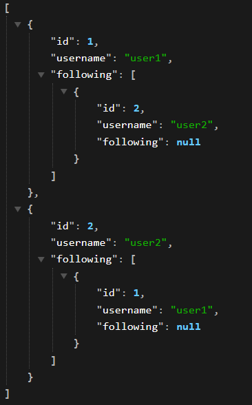

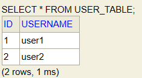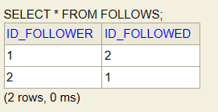

Upgrade do mini mundo: versão 1.1.0
===================================

Implementação disponível em: [https://github.com/feluzan/many2many/releases/tag/v1.1.0](https://www.google.com/url?q=https://github.com/feluzan/many2many/releases/tag/v1.1.0&sa=D&source=editors&ust=1687279839121122&usg=AOvVaw3wCI5sPDdNTllN-8BDxrxL)

Em uma atualização da versão 1.0, desejamos que o relacionamento seja bidirecional, ou seja, que um usuário tenha acesso direto à lista de quem ele está seguindo, mas também à lista de seus seguidores.

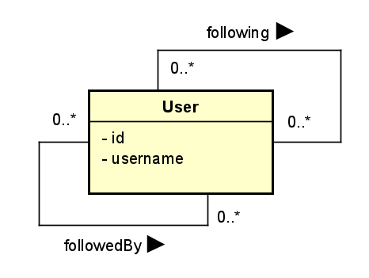

Assim como o ajuste realizado na v1.0.1, aqui também é necessário prevenir o loop infinito no mapper.

Com essa atualização, a resposta ao listar todos os usuários fica assim:

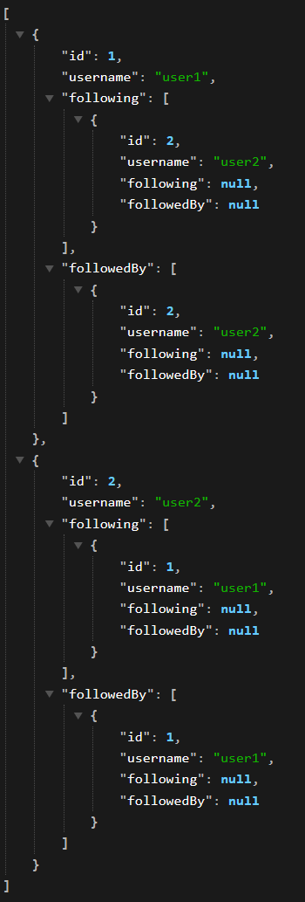

Ocultando os atributos NULL: versão 1.1.1
=========================================

Vamos ajustar o código para que a resposta dada pela chamada da API não entregue os atributos que são propositalmente NULL.

Isso se aplica para os atributos following e followedBy em segundo nível, que não são mapeados como foi explicado na versão 1.0.1.

Para isso utilizamos a biblioteca FasterXML/Jackson ([https://github.com/FasterXML/jackson/](https://www.google.com/url?q=https://github.com/FasterXML/jackson/&sa=D&source=editors&ust=1687279839122240&usg=AOvVaw0cyKHFkTYpNSGfrUAV42AV))

Com essa modificação, ao listar todos os usuários, temos esse resultado:

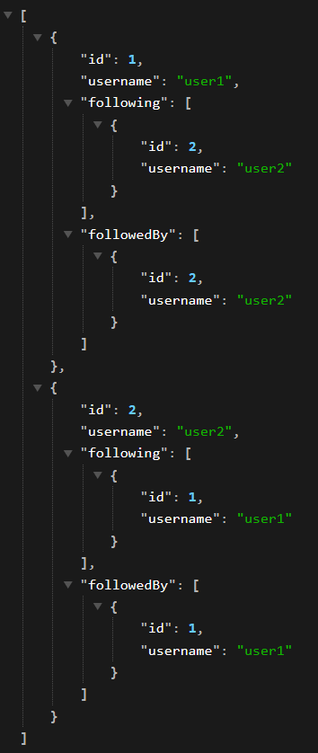

Mini mundo: versão 2.0.0
========================

Implementação disponível em [https://github.com/feluzan/many2many/releases/tag/v2.0.0](https://www.google.com/url?q=https://github.com/feluzan/many2many/releases/tag/v2.0.0&sa=D&source=editors&ust=1687279839122886&usg=AOvVaw0VGk8LHG7VCzRZjk9zhQxx)

O código desenvolvido como exemplo para a situação abrange um caso de uso de uma rede social. Nessa segunda versão vamos imaginar algo com requisitos parecidos com o Facebook.

No Facebook, dois usuários podem ser “amigos”. Esse relacionamento é, obrigatoriamente, recíproco.

Isso significa dizer que quando o user1 adiciona o user2 na sua lista de amigos, o user2 também adiciona o user1 na sua própria lista.

Vamos adaptar o código da versão 1.1.1 para esse novo modelo.

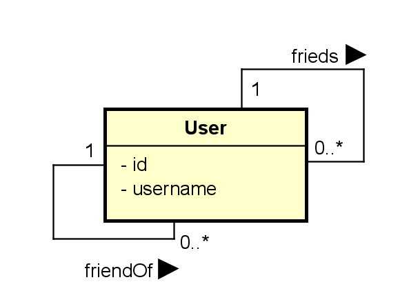

A modificação de regra de negócio se trata de adicionar a amizade entre os usuários de uma única vez, assim, ao invocar userService.addFriends(user1,user2), ambos irão aparecer na lista friends e friendOf um do outro:

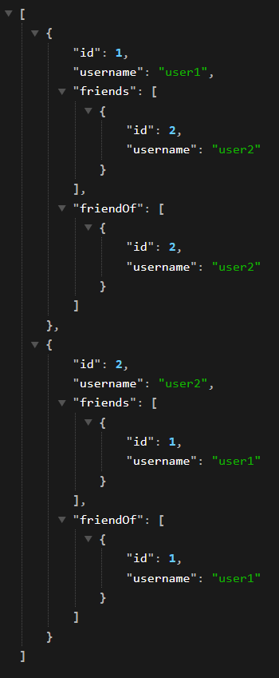

Problemas dessa implementação:

*   As listas “friends” e “friendOf” sempre serão idênticas para o mesmo objeto.
*   São necessários dois registros na tabela intermediária para a definição de uma única amizade.

Uma nova abordagem de implementação: versão 2.1.0
=================================================

Fazendo uma análise das diferenças entre como os dados das classes User e UserEntity serão utilizados, podemos elencar alguns pontos:

*   Na classe UserEntity as listas “friends” e “friendsOf” são necessárias para que a persistência seja realizada com sucesso, uma vez que na tabela associativa há de fato essa distinção.

*   As listas, nesse caso, ficam idênticas pois o registro de amizade está feito na tabela associativo duas vezes.

*   Na classe User não é necessário ter duas listas, uma vez que apenas uma lista com todas as amizades é suficiente.

Diante dessas análises, podemos realizar algumas modificações a fim de tentar resolver o problema de duplicidade de informação, tanto no banco de dados quanto nas listas “friends” e “friendsOf”.

1.  Na classe User, iremos definir uma lista “friendship” que será uma lista com todos os relacionamentos de amizade.

1.  Nessa classe ainda serão mantidas as listas “friends” e “friendOf”, porém elas nunca serão devolvidas ao usuário.
2.  Essas duas listas somente serão preenchidas imediatamente antes de o mapeamento de model para entity ser realizado.
3.  No preenchimento dessas listas, será respeitada a seguinte regra: se o atributo id do objeto usuário da lista for menor do que o do objeto principal, o objeto irá para a lista “friends”. Caso contrário, irá para a lista “friendOf”.

2.  Na classe UserEntity definiremos uma lista “friendship”. Esse atributo será transiente, isso é, nunca será persistido e nem recuperado do banco de dados.

1.  Nessa classe as listas “friends” e “friendOf” são as que defato representam o relacionamento de amizade entre usuários
2.  A lista “friendship” será uma junção das duas listas anteriores, e isso só será realizado imediatamente antes do mapeamento de entity para model.

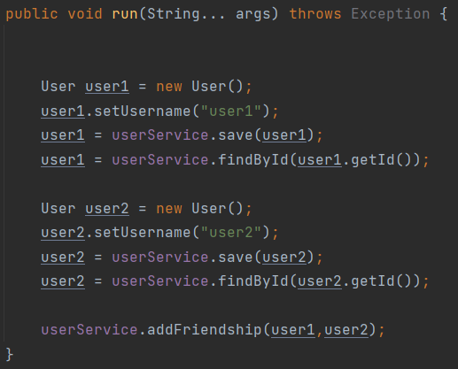

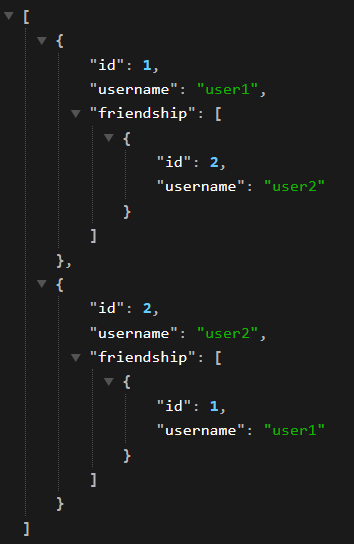

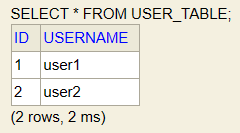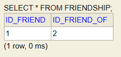

Aumentando o exemplo para 4 usuários:

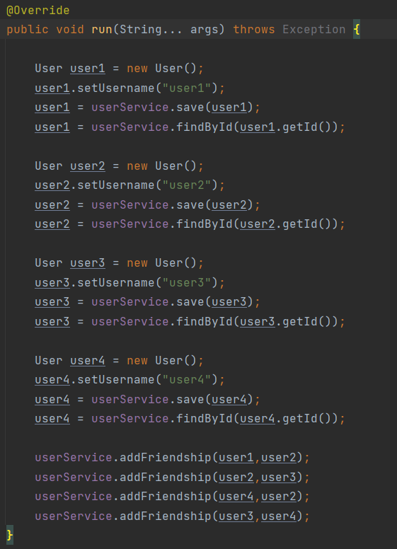

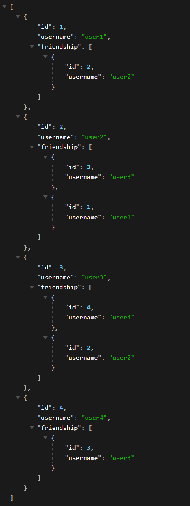

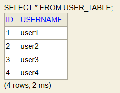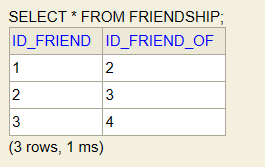

Observe que na tabela associativa, o menor ID sempre estará à esquerda.